当前版本：v1.0

开发版本：v1.0_Dev2025.05_Alpha_2

（版本号说明）
正式版本：vx.y

开发版本/预发布版本：vx.y（本次开发基于的正式版本号）

_DevYYYY.MM（Dev版本及其本次开发完成时所属月份）

_Alpha/Beta（标识版本完成度，Alpha为新功能无法正常运行；Beta为功能能够正常运行但是本次更新目标没有开发完毕）

_z（本月本版本第几次更新）

TooManyThings是基于Python语言及其Tkinter等模块开发的一款个人待办事项平台

本平台包括两个大模块：待办模块与书籍管理模块

待办模块提供待办添加，待办四项分类法，待办查询，待办编辑和待办删除功能

书籍管理模块提供单本书录入、批量录入、EPUB 录入和书籍数据编辑四大功能

本软件数据库采用MySQL语言，暂无跨平台同步功能，属于本地系统

# 一、UI说明

当你启动UImain.py时，会显示如下的主页面

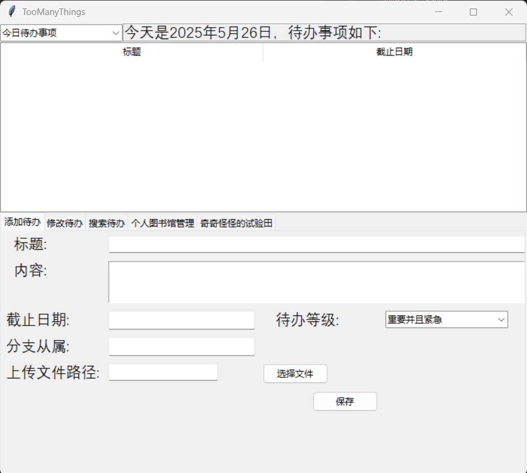

主页面左上角选项框和上方“标题-截止日期”显示框联动，可以选择想要展示的内容，包括：

“今日待办事项”

“全部待办事项”

“重要并且紧急”

“不重要但紧急”

“重要但不紧急”

“不重要不紧急”

“已经完成事项”

七个选择项。不同选择项所对应展示的内容不同

（此处还有一个"查找结果展示”，是适配搜索功能使用的，直接选择打开会报错）

下方添加待办处可以输入标题，内容，截止日期，并选择待办等级。

**注意：截止日期格式必须为YYYY-MM-DD格式，否则可能会出现显示错误**

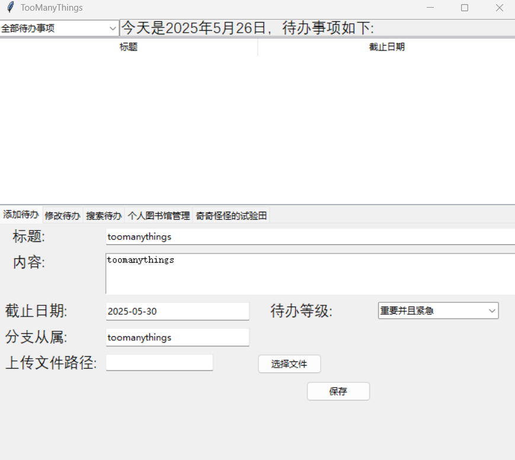

全部输入完成后点击保存，会将内容输入进显示框内，并清空“添加待办”中的内容

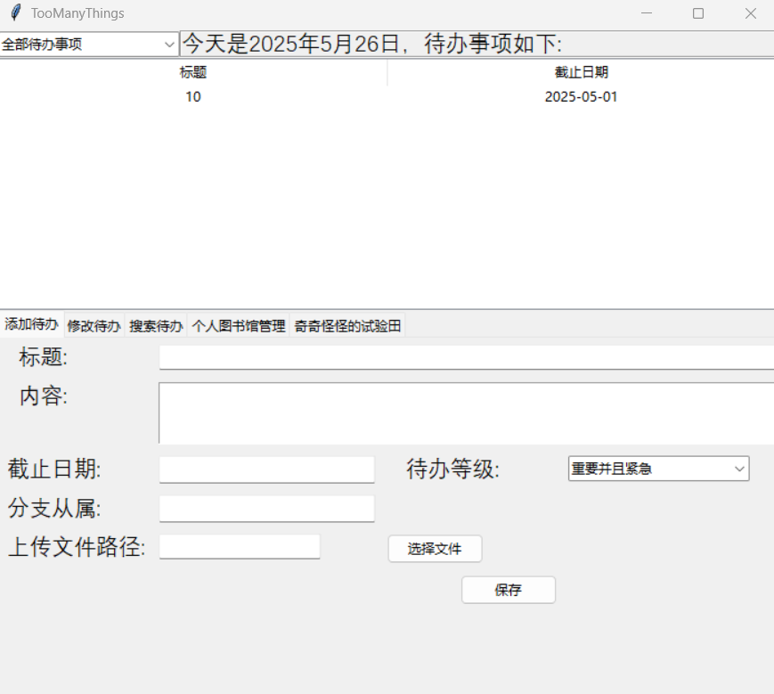

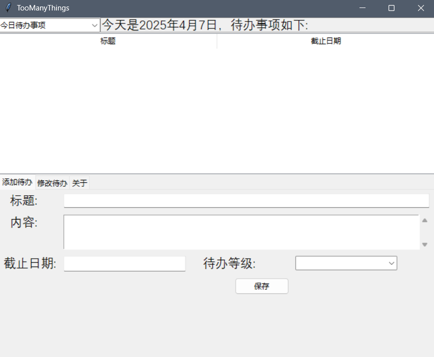

当双击显示框内的内容时，会跳转到“修改待办页面”

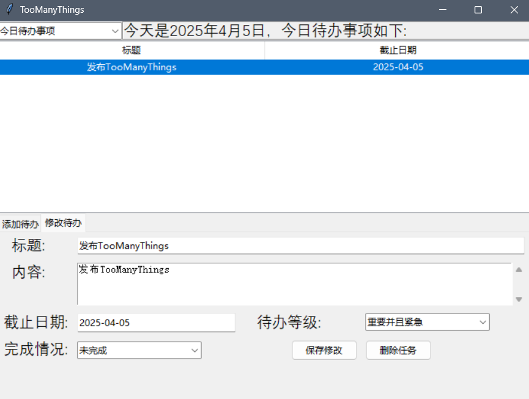

在此处可以对待办的标题、内容、截止日期、待办等级、完成情况进行修改。修改完成后点击“保存修改”就完成了修改

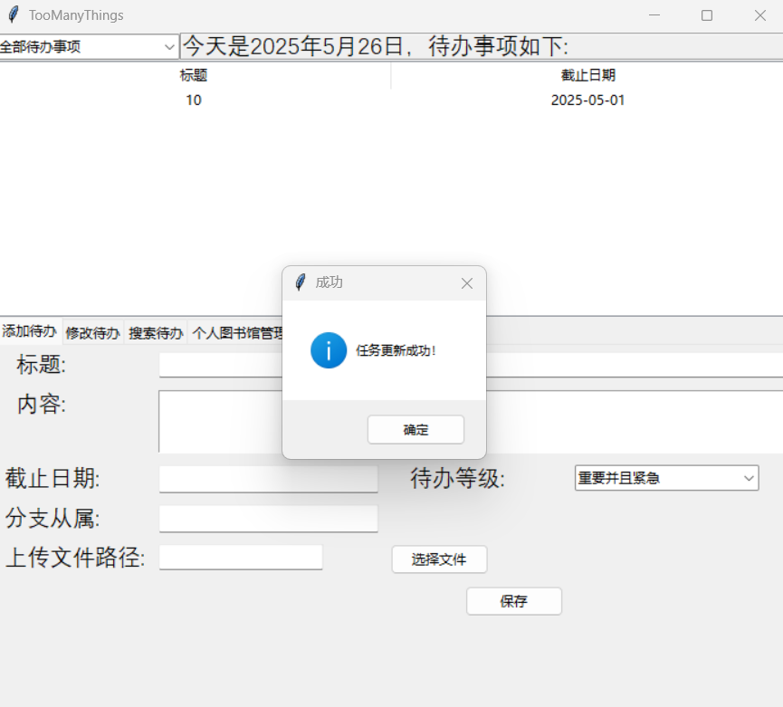

点击删除任务会从数据库中删除该任务。操作完成后会刷新显示框

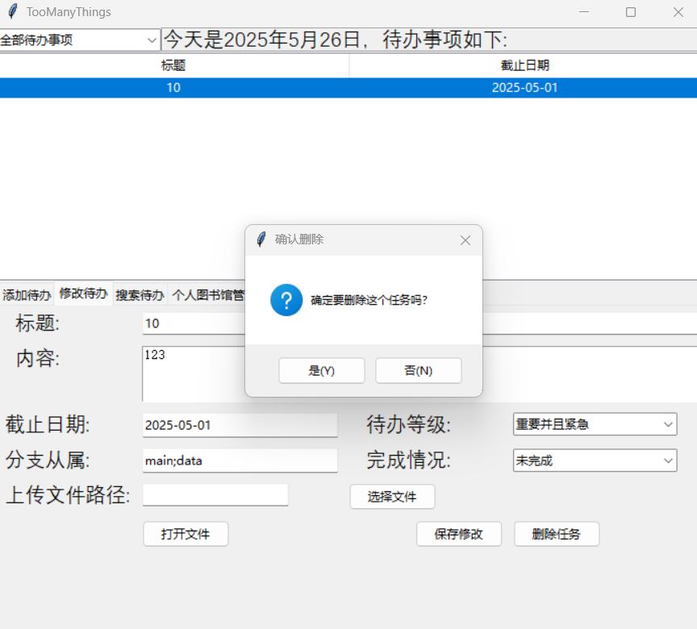

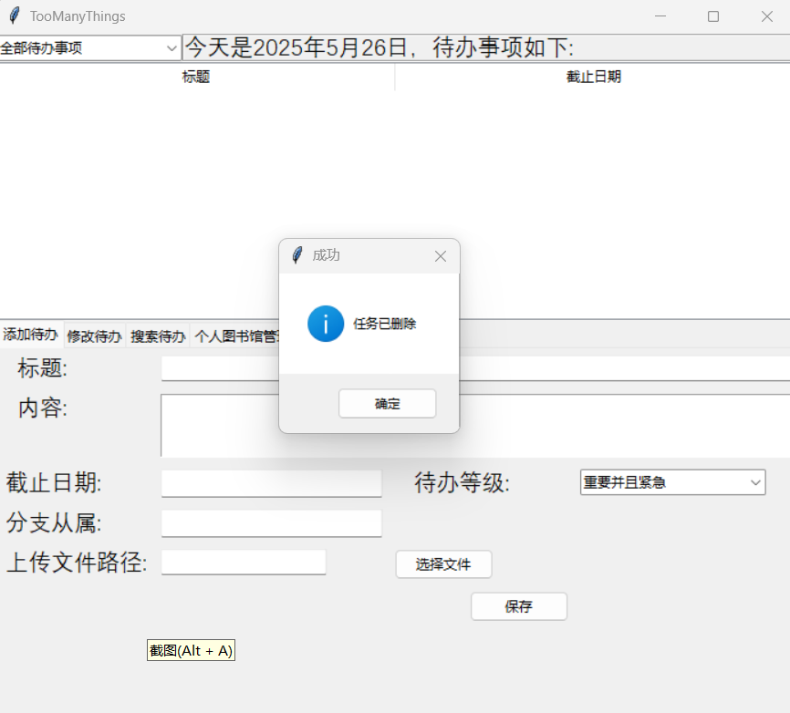

在"搜索待办"中，可以通过输入分支内容来查找待办事项，结果会显示在上方

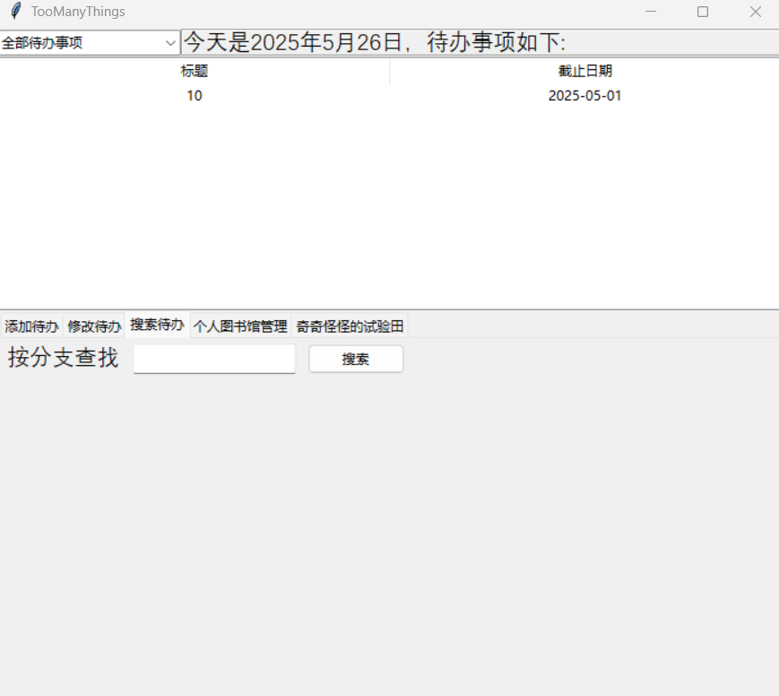

在"个人图书馆管理"中，可以对书籍数据进行处理

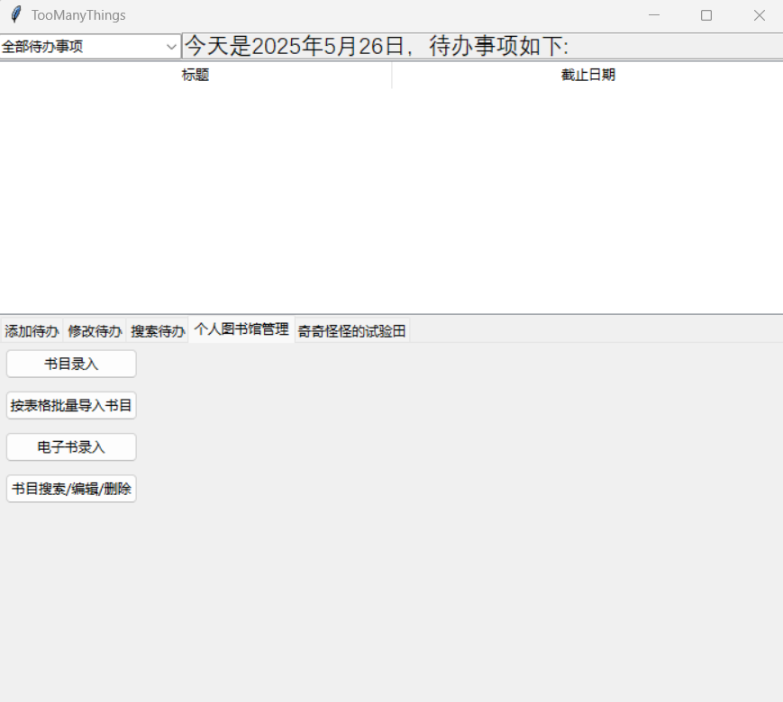

点击"书目录入"，在打开的页面中可以输入单本书的信息，其中标“\*”的选项是必填项

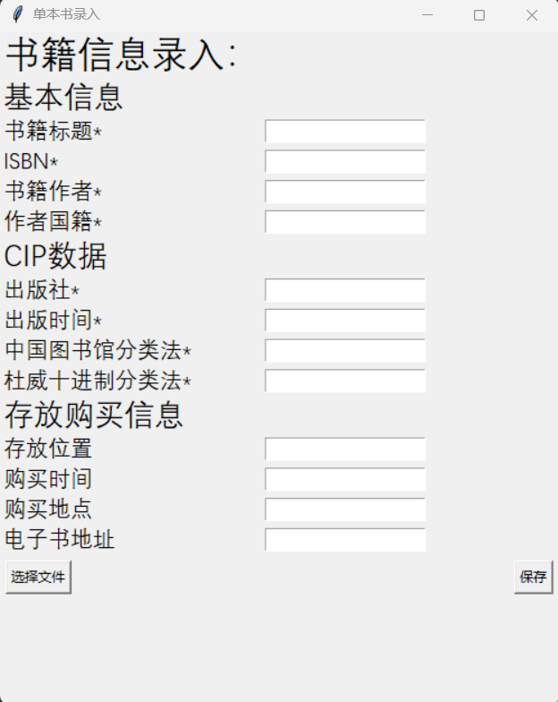

点击“按表格批量导入书目”，在打开的页面中可以上传 xlsx 文件进行批量录入（注意，xlsx 文件样例为根目录下“ex.xlsx”）

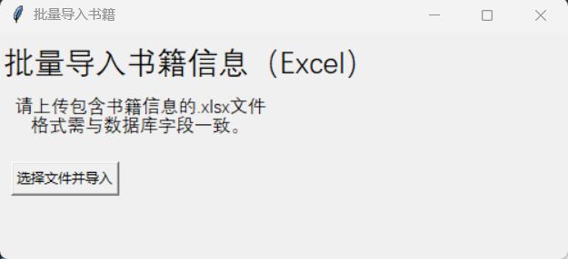

点击“电子书录入”，此处可以录入一本 EPUB 格式电子书，并且会自动提取作者、出版社、书名等信息输入数据库

点击"书目搜索/编辑/删除"，此处可以搜索需要修改的书籍并对其进行修改，默认会显示全部书籍

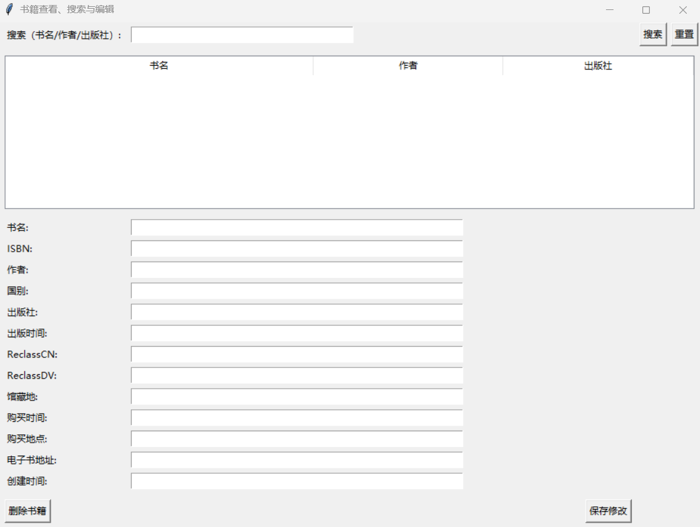

在“奇奇怪怪的试验田”中，有"一日计划安排"“AI对话”和“关于”几个选项

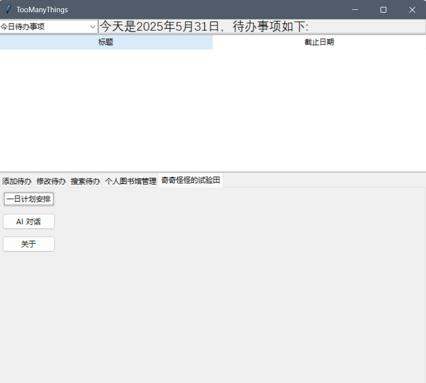

“一日计划安排”目前还在开发，情况如下图所示。

同时添加了对接Ollama的大模型接口功能，此处对接了运行于本地的deepseek-r1 7b模型，端口号"http://localhost:11434"（写于constant.py中）

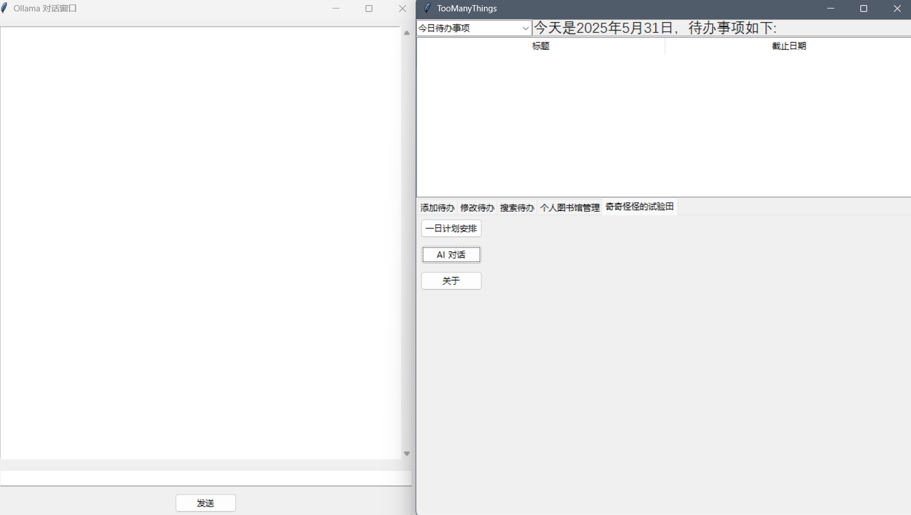

“关于”展示了本平台的一些基本信息。

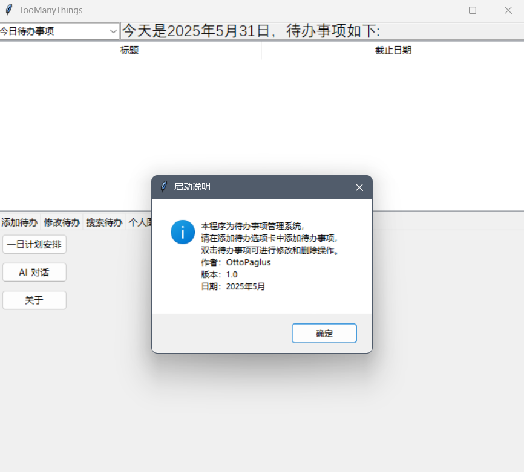

# 二、各个Python类及其说明

1. book_editor.py：用于对书籍数据进行处理
2. book_epub_reader.py：用于读取EPUB数据
3. book_excel_import.py：用于读取表格形式的excel数据
4. book_single_entry.py：用于单本书的数据输入
5. constant.py：存储全局变量和版本信息
6. file_helper.py：文件操作集成体
7. Ollama_chat.py：Ollama本地大语言模型调用
8. SiliconFlowClient.py：硅基流动API调用（开发中）
9. todo_create.py：创建待办
10. todo_edit.py：编辑待办
11. todo_query.py：待办显示
12. todo_search.py：待办查询
13. UImain.py：UI主页面

# 三、后续改进

1. 完善时间表模块的开发
2. 解决“搜索结果展示”的报错问题
3. 支持更多书籍格式
4. 完成 ISBN 和两种分类方式的自动获取与分类赋值
5. 完成硅基流动API调用，整合AI大语言模型
远期计划：更改 UI 框架
